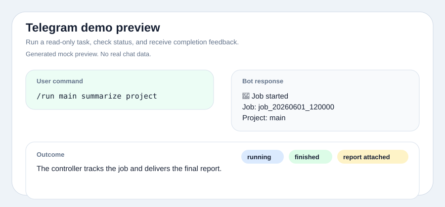
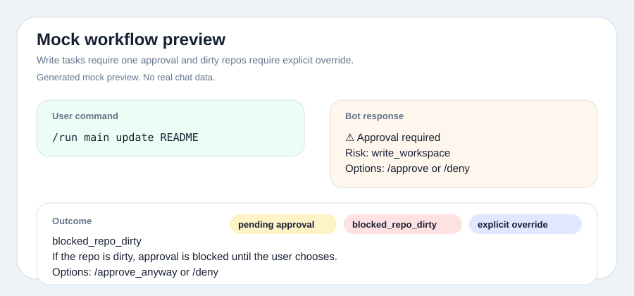
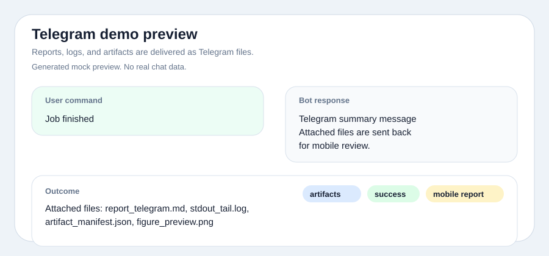

# codex-job-relay

Mobile-first local job controller for Codex-assisted long-running workflows.

`codex-job-relay` lets you start, approve, monitor, cancel, and receive reports
for local long-running jobs from Telegram. It is built for workflows where the
useful unit is a job: evaluation, benchmark, training, report generation, or
artifact-producing automation.

It is not a normal Telegram Codex chat bridge, and it is not a replacement for
the official Codex App. The relay is job-first, not thread-first.

## Why This Exists

- The official Codex App is useful at the desk, but mobile report/artifact
  preview and long-running task notifications can be awkward.
- Generic Telegram Codex bridges are usually conversation or thread oriented.
- This project focuses on job control, progress tracking, artifact delivery,
  mobile-readable reports, and safe local execution.

## Architecture

```text
Telegram Mobile
  -> Telegram Bot API long polling
  -> Local Windows controller
  -> Codex CLI / local whitelist jobs
  -> Local project workspace
  -> reports / logs / artifacts
  -> Telegram summary + files
```

The controller uses Telegram long polling. It does not open a public port or run
a webhook server.

## Features

- `/run <project> <prompt>` starts a Codex-assisted job in a whitelisted project.
- `/train_local <alias>` starts an experimental whitelist local training job.
- `/status` shows active job state, project, risk, runtime, and next action.
- `/cancel` terminates the active subprocess.
- `/report` resends the latest report.
- `/approve [job_id]` approves a pending job when the repo is clean.
- `/deny [job_id]` denies a pending or blocked job.
- `/approve_anyway [job_id]` runs a blocked job despite existing repo changes.
- Explicit state machine: `pending_approval`, `blocked_repo_dirty`, `running`,
  `success`, `failed`, `denied`, `rejected`, `cancelled`.
- Fallback `report.md` is generated when Codex does not create one.
- Telegram-friendly `report_telegram.md` is written as UTF-8 with BOM
  (`utf-8-sig`) before upload.
- Safe process execution through `subprocess.Popen([...], shell=False)`.
- Telegram user allowlist via `TELEGRAM_ALLOWED_USER_ID`.
- The controller does not accept arbitrary shell commands.

## Demo

These are generated mock previews, not real chat screenshots. They use example
data only and do not include real tokens, user ids, local paths, or account
names.

Run and status flow:



Approval and dirty repository flow:



Report and artifact delivery:



## Install

### 1. Create A Telegram Bot

1. Open Telegram and chat with `@BotFather`.
2. Send `/newbot` and follow the prompts.
3. Copy the bot token into `TELEGRAM_BOT_TOKEN`.
4. Get your numeric Telegram user id, for example from `@userinfobot`, and put
   it in `TELEGRAM_ALLOWED_USER_ID`.

Use a private 1:1 chat with the bot. Telegram normal bot chats are not
end-to-end encrypted.

### 2. Create `.env`

From the repository root:

```powershell
copy telegram_codex_controller\config.example.env telegram_codex_controller\.env
```

Example `.env`:

```env
TELEGRAM_BOT_TOKEN=
TELEGRAM_ALLOWED_USER_ID=
CODEX_COMMAND=C:\Users\<YOU>\AppData\Roaming\npm\codex.cmd
DEFAULT_SANDBOX=workspace-write
PROJECT_MAIN=D:\LocalProject
PROJECT_SECONDARY=D:\OtherProject
JOBS_DIR=D:\Documents\codex controller\telegram_codex_controller\jobs
POLL_INTERVAL_SECONDS=2
```

Do not commit `.env`.

### 3. Create Venv And Install Requirements

```powershell
py -m venv .venv
.\.venv\Scripts\activate
pip install -r telegram_codex_controller\requirements.txt
```

If `python` opens the Microsoft Store alias on Windows, use the Python Launcher
with `py`.

### 4. Start The Controller

```powershell
py telegram_codex_controller\controller.py
```

## Commands

```text
/help
/run <project> <prompt>
/train_local <alias>
/status
/cancel
/report
/approve [job_id]
/deny [job_id]
/approve_anyway [job_id]
```

## Approval Model

Low-risk read-only jobs run automatically. Write and expensive jobs require
approval.

```text
/run write task
-> pending_approval
-> /approve
   -> running, if repo clean
   -> blocked_repo_dirty, if repo dirty
-> /approve_anyway
   -> running despite dirty repo
-> /deny
   -> denied
```

`/approve` only starts the job when `git status --short` is clean.
`/approve_anyway` is required when the repo already has uncommitted or
untracked changes.

## Risk Levels

- `read_only`: inspect, analyze, summarize, review, and report. Codex may run
  safe read-only checks, but must not start training.
- `write_workspace`: modify code or config inside the workspace. Long training
  should not start unless the user explicitly requested it.
- `run_expensive`: training, full evaluation, benchmark, or long run. Approval
  is required.
- `dangerous`: destructive or secret-related requests are rejected before Codex
  starts.

## Experimental Local Training

`/train_local <alias>` is an experimental whitelist local job. It is intended as
a small integration point for teams that already have local scripts and config
files. It is not a complete ML workflow manager.

Default example aliases:

```text
default
resume
experiment
```

Aliases map only to controller-defined config files. Users cannot pass arbitrary
config paths or shell commands. The controller starts the local Python process
directly:

```powershell
<project>\.venv\Scripts\python.exe scripts\train.py --config <config> --run-name <run_name>
```

See `examples/job_config.example.yaml` for a future YAML-based job definition
shape.

## Job Files

Each job creates a directory under `telegram_codex_controller/jobs`:

```text
jobs/job_YYYYMMDD_HHMMSS/
  prompt.txt
  codex_prompt.txt
  stdout.log
  stderr.log
  train_stdout.log
  train_stderr.log
  report.md
  report_telegram.md
  diff_stat.txt
  metadata.json
```

Codex jobs use `stdout.log` and `stderr.log`. Local training jobs use
`train_stdout.log` and `train_stderr.log`.

## Security Boundaries

- No public port is opened.
- Telegram long polling only; no webhook.
- Only the configured `TELEGRAM_ALLOWED_USER_ID` can run jobs.
- `.env` is ignored and must not be committed.
- Arbitrary shell commands are not accepted.
- Project paths are selected from config, not Telegram input.
- `/train_local` accepts whitelist aliases only.
- Write and long-running jobs require approval.
- Dirty repos become `blocked_repo_dirty`.
- `/approve_anyway` requires explicit user action.
- `danger-full-access` is rejected by the controller.
- `--dangerously-bypass-approvals-and-sandbox` is not used.
- `subprocess.Popen` uses a list of arguments and `shell=False`.

## Examples

- `examples/sample_report_telegram.md`
- `examples/job_config.example.yaml`

## Offline Verification

```powershell
py telegram_codex_controller\controller.py --self-test
py -m py_compile telegram_codex_controller\controller.py
```

## Roadmap

- `/train <alias>` generic whitelist local jobs
- heartbeat notification
- artifact manifest
- image preview delivery
- HTML/PDF mobile report
- GitHub Actions self-test
- YAML job definitions
